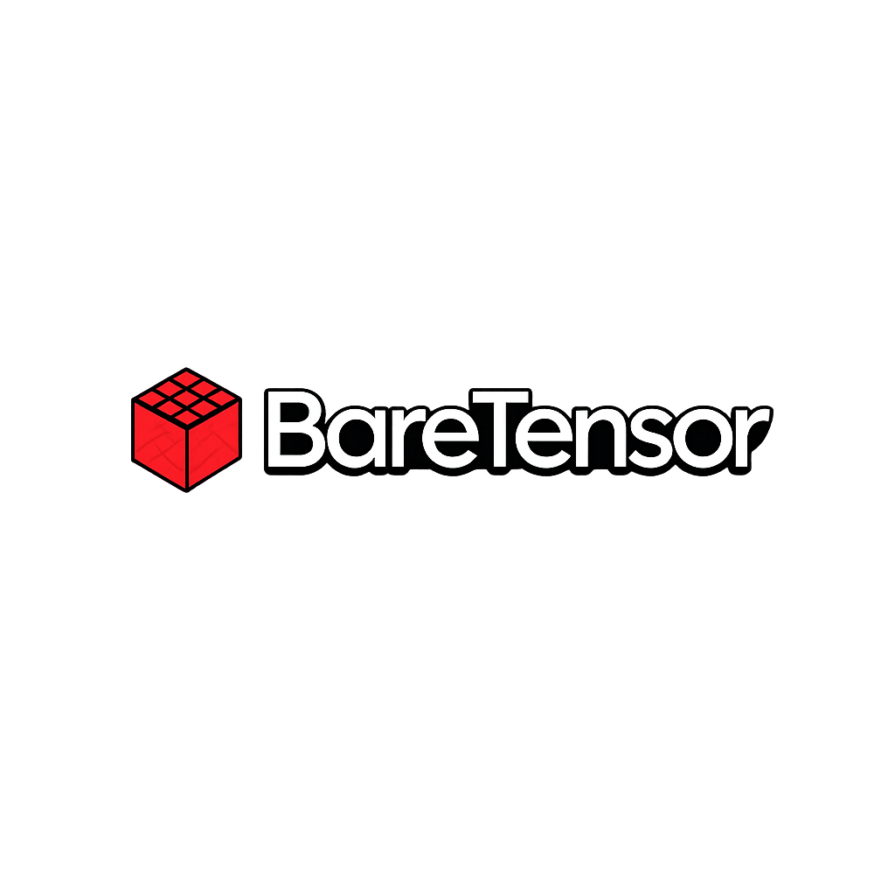

# BareTensor 🚀

[](https://www.python.org/)
[](https://numpy.org/)
[](https://github.com/Omnivex3/BareTensor)
[](LICENSE)



Autograd engine and transformer framework in pure Python/NumPy — verified against PyTorch's C++ backend to ≤ 1e⁻⁴.

---

## Quickstart

```bash
pip install -e .
pytest tests/
```

```python
from baretensor import Tensor

# Forward pass traces the graph automatically
x = Tensor([[1.0, 2.0]], requires_grad=True)
w = Tensor([[0.5], [-0.3]], requires_grad=True)
y = x @ w
y.backward()

print(w.grad)  # exact analytical gradient, not an approximation
```

---

## What's Here

- **Autograd engine** — dynamic DAG, topological sort, reverse-mode differentiation
- **Analytical Jacobians** — Softmax Cross-Entropy, LayerNorm, Batched MatMul. No numerical approximation
- **Gradient un-broadcasting** — correctly collapses broadcasted dimensions across batch axes
- **Micro-GPT** — autoregressive Transformer Decoder with causal masking, positional embeddings, scatter-add gradient routing
- **Module system** — `Module`/`Linear`/`Embedding` with recursive param tracking and `state_dict` serialization
- **Optimizers** — `SGD` (vanilla) and `Adam` (adaptive, bias-corrected, optional weight decay)

---

## Verified Against PyTorch

| Feature | Status | Test |
| :--- | :---: | :--- |
| Linear + ReLU autograd | ✅ | `test_linear_relu_autograd` |
| Layer Normalization (3D) | ✅ | `test_layer_norm_3d_autograd` |
| Multi-Head Attention | ✅ | `test_mha_autograd_parity` |
| Softmax Cross-Entropy | ✅ | `test_cross_entropy_parity` |
| Causal Masking | ✅ | `test_causal_mask_parity` |

---

## Architecture

```python
class MicroGPT(Module):
    def __init__(self, vocab_size, d_model, num_heads):
        self.token_emb = Embedding(vocab_size, d_model)
        self.transformer = TransformerEncoderBlock(d_model, num_heads)
        self.lm_head = Linear(d_model, vocab_size)

    def __call__(self, idx, mask=None):
        x = self.token_emb(idx)
        x = self.transformer(x, mask=mask)
        return self.lm_head(x)
```
